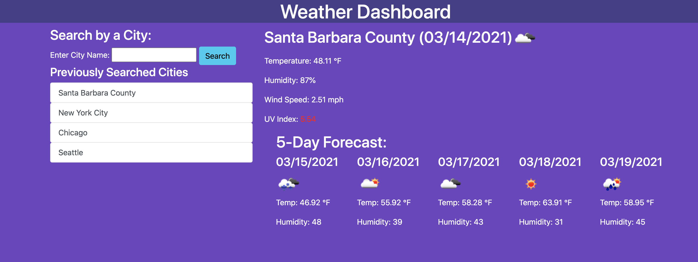

## Weather Dashboard

With the Weather Dashboard application, users are able to search for a particular city to learn about the current weather, and see the 5-day forecast. Their previous searches will be saved so they can quickly search locations they are interested in.

This application was built using HTML, CSS, Javascript and Bootstrap. It was deployed using Github Pages.

Users can find a link to the application [here](https://squidbeaks.github.io/weather-dashboard/).

